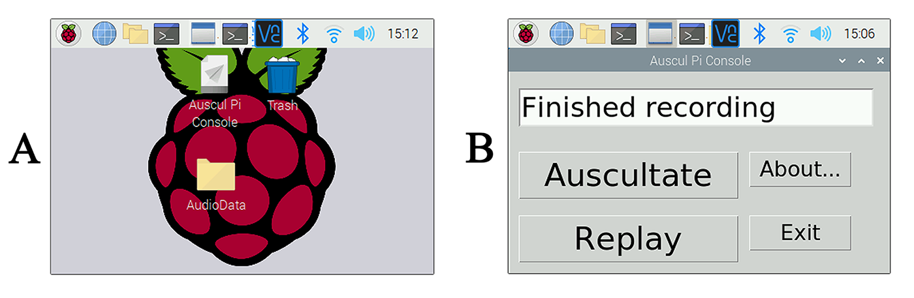

# Auscul Pi Console
A Low-Cost Ear-Contactless Stethoscope Powered by Raspberry Pi and Python.

***Chuan Yang*** (<yangc@sj-hospital.org>)

## Introduction
Since the outbreak of COVID-19, more and more physicians and nurses have been participating the battle to coronavirus at the first line treatment. Almost all patients in critical status were having pneumonia, respiratory failure and/or acute respiratory distress syndrome. So, auscultation was important for those patients to achieve accurate diagnosis, assessment of current severity and treatment efficacy. However, inside quarantine ward in hospitals, medical staff who were wearing protective clothing were unable to use conventional stethoscopes due to the head protective suit covering the regions of their ears. Auscultation examination was essential but hard to accomplished especially to the patients with poor respiratory conditions, such as severe pneumonia, respiratory dysfunction, intensive cases who were intubated and assisted with ventilators. Some experts have viewpoint suggesting less stethoscope and more ultrasound, while other experts stress the necessity of stethoscope and auscultation in COVID-19 treatment. 

To challenge this paradox circumstance, we developed an electronic stethoscope using a credit card sized single-board computer (SBC), Raspberry Pi, connected to a chest piece of a conventional stethoscope and a tiny speaker, which can be easily modified by medical staff themselves. The software run by raspberry pi coded in python programming language was open source and has already been published on GitHub repository. All users who are interest in the stethoscope all around the world can assemble the components easily and download the software freely in a do-it-yourself (DIY) way. 
[](README.md)

## Prerequisites
### Install the Audio (Essential!!!)
This option is only adopted by Python specialist. There are several dependencies necessarily preinstalled in your Python interpreter:

- **PyAudio**
```
$ sudo apt install python3-pyaudio
 ```
Else if you are running python 2.7
```
$ sudo apt install python-pyaudio 
```

- Config the audio settings of Raspberry Pi
Type the following command:
```
$ sudo raspi-config
```
Select "Advanced Options", then select "Audio", press Enter. After that select "Finish".

### Test and Regulate the audio settings

- Check the hardware of record and play configuration:
The record function:
```
$ arecord -l
```
The play function:
```
$ aplay -l
```
Find the card # and device #
For instance, the record is card 1 and device 0, and play is card 0 and device 0:

- Adjust the volume:

Use this command to adjust volume of microphone and speaker
```
$ alsamixer
```
Press F4 or F6 to select the volume

- Test the audio:

Speaker:
 ```
$ speaker-test –t wav
```
Microphone:
```
$ arecord --format=S16_LE --duration=5 --rate=16000 --file-type=raw sample.wav
aplay --format=S16_LE --rate=16000 sample.wav
```
### Touch screen installation
- Change HDMI to Touch Screen:
Copy and paste the following lines to terminal:
```
sudo rm -rf LCD-show 

git clone https://github.com/goodtft/LCD-show.git 

chmod -R 755 LCD-show 

cd LCD-show/

sudo ./LCD35-show
```
- Back to HDMI display mode:
If you want to change Touch Screen back to HDMI display model, paste the following:
```
chmod -R 755 LCD-show 

cd LCD-show/ 

sudo ./LCD-hdmi
```

### PyInstaller
For the GUI application, we'd better use mouse-click to open the application. Run this:
```
pip3 install pyinstaller
```

### Launch the application from desktop
Create a new file called *AusculPiConsole.desktop*. Attention, the extesion of the file is .desktop! The content is as below:
```
[Desktop Entry]
Name=Auscul Pi Console
Comment= Application for LCECS
Icon=
Exec=/home/pi/Documents/Code/AusculPi/AusculPiConsole/AusculPiConsole
Type=Application
Encoding=UTF-8
Terminal=false
```

## License
The MIT License (MIT)

Copyright (c) 2020 Chuan Yang

Permission is hereby granted, free of charge, to any person obtaining a copy
of this software and associated documentation files (the "Software"), to deal
in the Software without restriction, including without limitation the rights
to use, copy, modify, merge, publish, distribute, sublicense, and/or sell
copies of the Software, and to permit persons to whom the Software is
furnished to do so, subject to the following conditions:

The above copyright notice and this permission notice shall be included in all
copies or substantial portions of the Software.

THE SOFTWARE IS PROVIDED "AS IS", WITHOUT WARRANTY OF ANY KIND, EXPRESS OR
IMPLIED, INCLUDING BUT NOT LIMITED TO THE WARRANTIES OF MERCHANTABILITY,
FITNESS FOR A PARTICULAR PURPOSE AND NONINFRINGEMENT. IN NO EVENT SHALL THE
AUTHORS OR COPYRIGHT HOLDERS BE LIABLE FOR ANY CLAIM, DAMAGES OR OTHER
LIABILITY, WHETHER IN AN ACTION OF CONTRACT, TORT OR OTHERWISE, ARISING FROM,
OUT OF OR IN CONNECTION WITH THE SOFTWARE OR THE USE OR OTHER DEALINGS IN THE
SOFTWARE.

## Contributor List
- **Zhixuan Pang**, High-school Student, Sewickley Academy 
